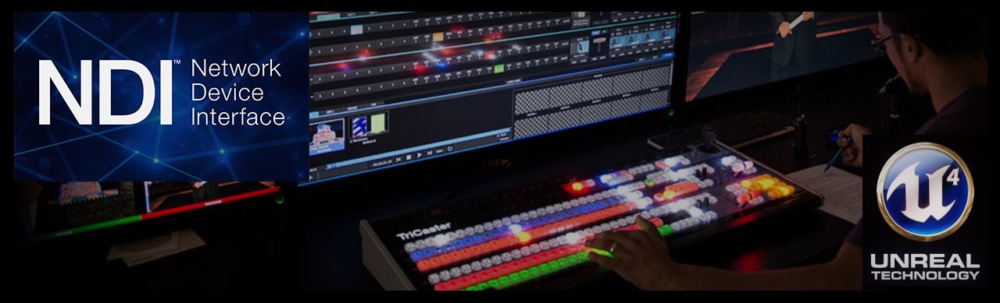

# NdiMedia

Unreal Engine 4 Media Framework plug-in for NewTek's Network Device Interface (NDI).

## About

NDI™ (Network Device Interface) is a standard created by NewTek to make it easy
to develop video-related products that share video on a local Ethernet network
(video over IP). This plug-in makes NDI media input streams available in Unreal
Engine 4.

Make sure to pull the *Tag* that matches your Unreal Engine version. If you sync
to *Master* the code may not compile, because it may depend on Engine changes
that are not yet available in the UE4 Master branch.

## Supported Platforms

This plug-in was last built against **Unreal Engine 4.14** and tested on the
following platforms:

- ~~iOS~~
- ~~Linux~~
- ~~macOS~~
- Windows

## Prerequisites

All required header files and libraries for supported platforms are included in
this plug-in. If you'd like to make modifications to this plug-in, download the
latest version of the NDI SDK from the Newtek web site for updated documentation
and files.

## Dependencies

This plug-in requires Visual Studio and either a C++ code project or the full
Unreal Engine 4 source code from GitHub. If you are new to programming in UE4,
please see the official [Programming Guide](https://docs.unrealengine.com/latest/INT/Programming/index.html)! 

## Usage

You can use this plug-in as a project plug-in, or an Engine plug-in.

If you use it as a project plug-in, clone this repository into your project's
*/Plugins* directory and compile your game in Visual Studio. A C++ code project
is required for this to work.

If you use it as an Engine plug-in, clone this repository into the
*/Engine/Plugins/Media* directory and compile your game. Full Unreal Engine 4
source code from GitHub is required for this.

## Support

Please [file an issue](https://github.com/ue4plugins/NdiMedia/issues), submit a
[pull request](https://github.com/ue4plugins/NdiMedia/pulls?q=is%3Aopen+is%3Apr)
or email us at info@headcrash.industries

## References

* [NewTek NDI SDK Download](http://pages.newtek.com/NDI-Developers.html)
* [NewTek NDI Homepage](http://newtek.com/ndi.html)
* [Introduction to UE4 Plugins](https://wiki.unrealengine.com/An_Introduction_to_UE4_Plugins)
